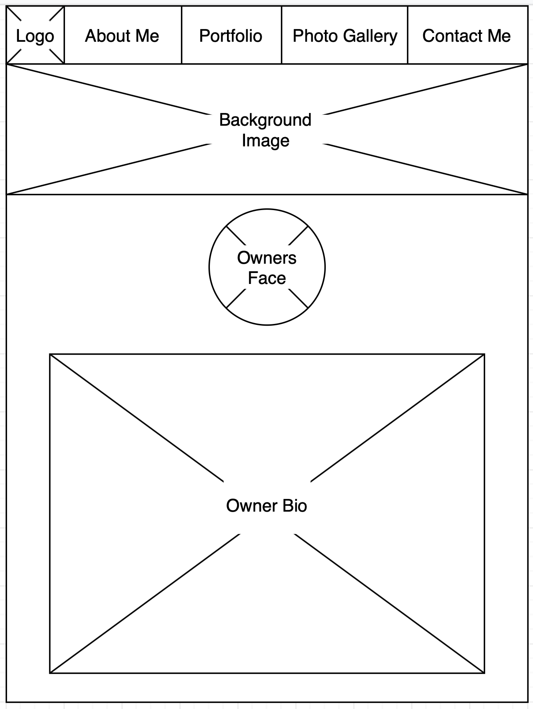
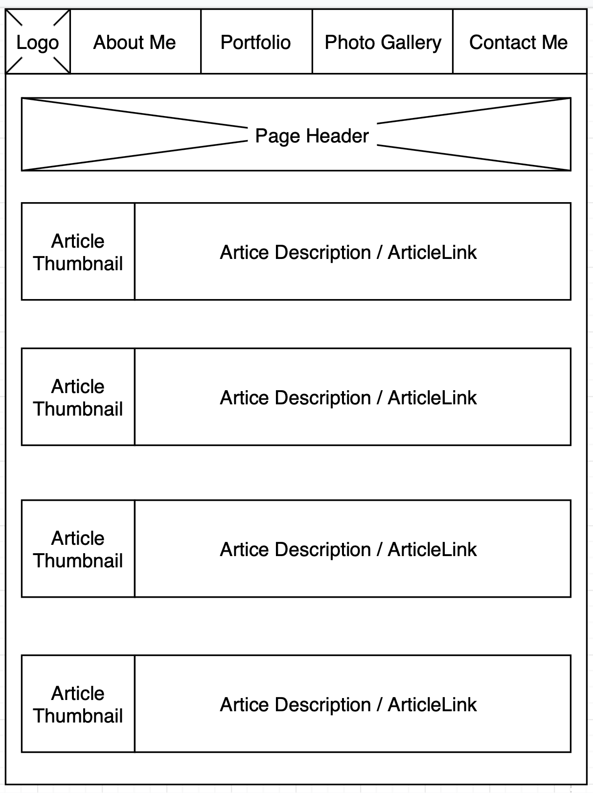
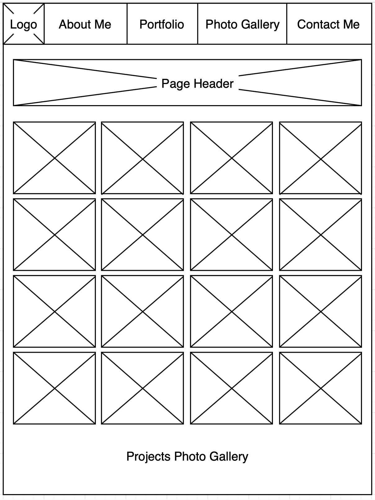
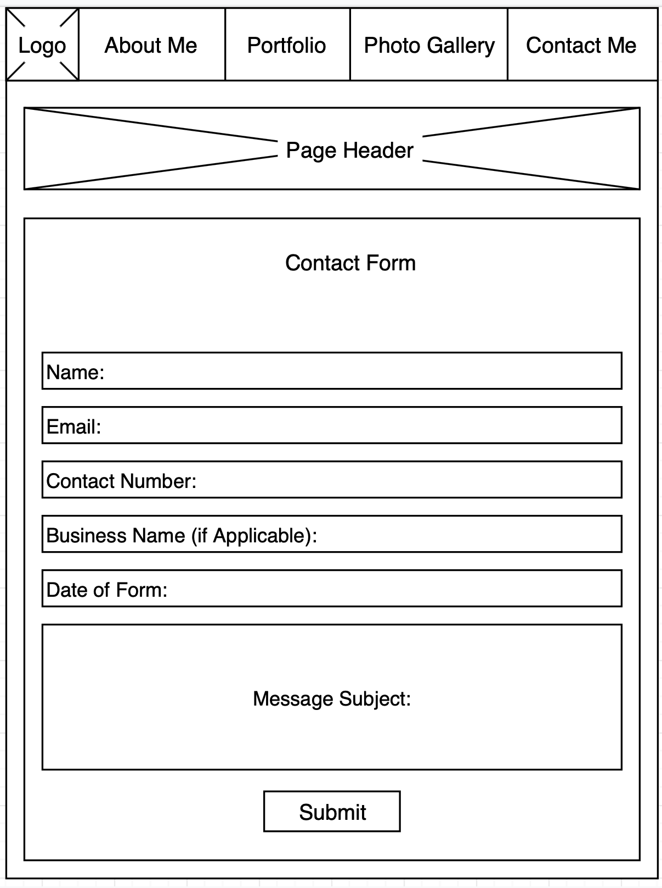
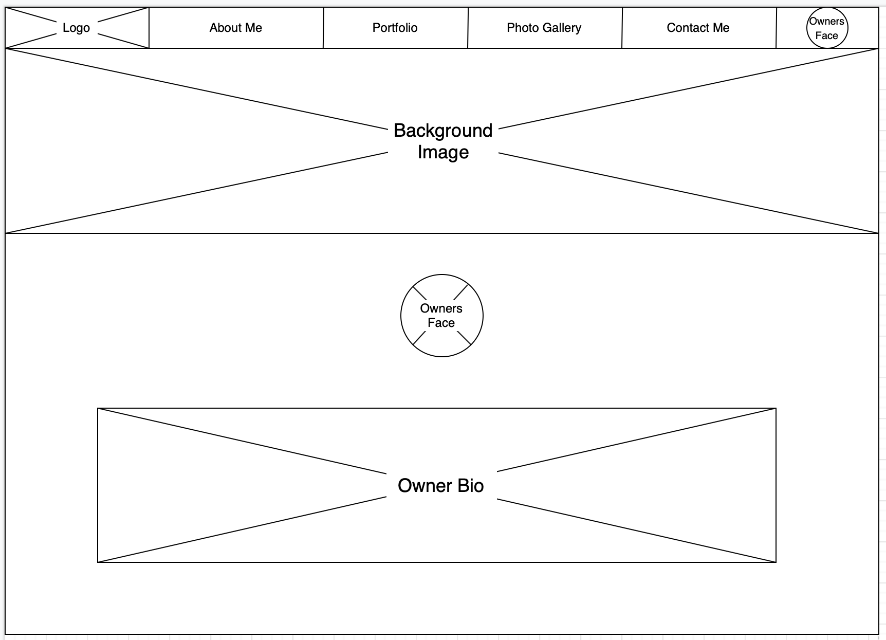
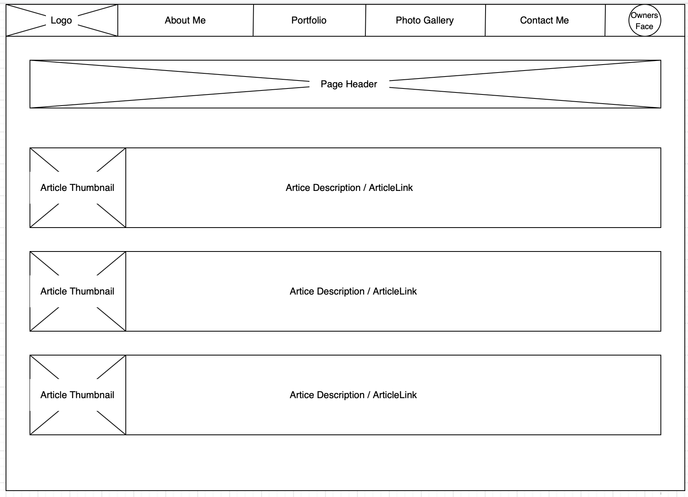
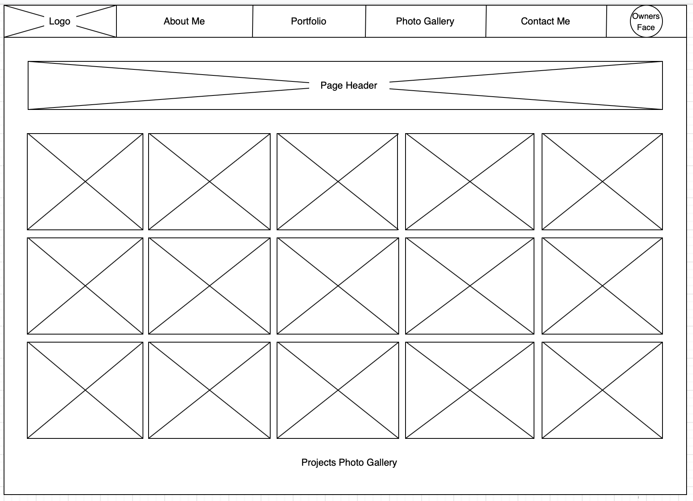
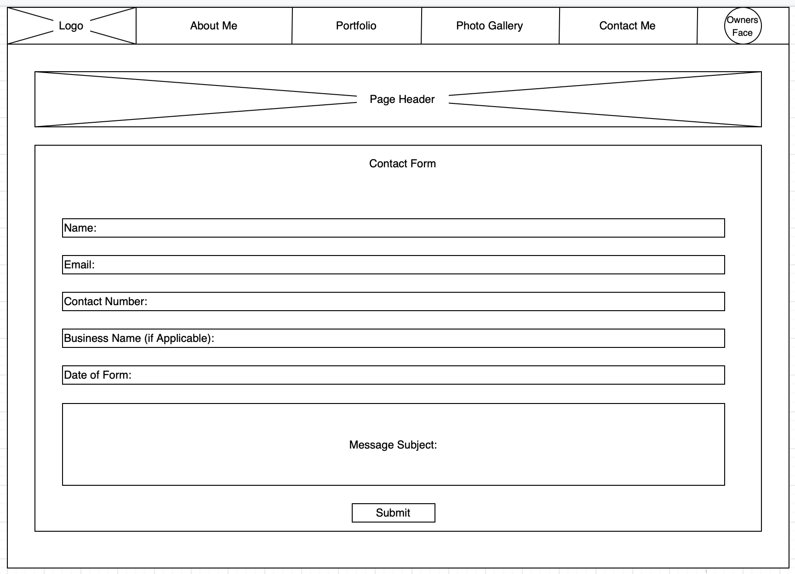
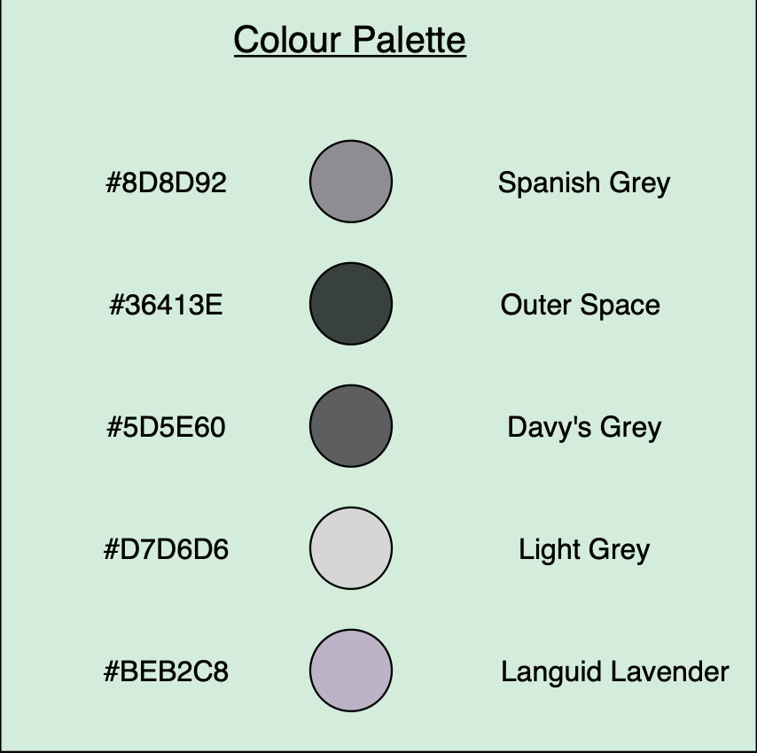

# Web Technologies CDA404 Assessment Report 
### Student: Jordan Duo                  
### Tutor: Joe Appleton
### Date: 26/05/2020

## 1.Background
The problem faced in this assessment is the challenge of being able to get your name out in the public domain. It is a common problem faced by many people in modern society. This is especially frequent with people who are looking for jobs, or are trying to get some sort of business-orientated following. Many people would love to have some sort of platform where they could display their achievements, list their qualities, and form connections with employers.

## 2.Wire Frames
### 2.1.Mobile Wire Frames

### 2.2.Desktop Wire Frames

## 3.Colour Choices
### 3.1.Website Colour Palette

The colours chosen for the website colour palette were a combo of different shades of grey, along with a light lavender colour. The colour grey was chosen as the main source of colour as it gives the sense of sophistication and gives the user the impression of a formal and professional website. Lavender, and other shades of purple, go very well with grey shades and can be seen among many existing websites. 
## 4.Accessibility
There are many features within the web design that take into account users with disabilities. Careful consideration and planning has been done to ensure that all users can have unprecedented access to the site.
### 4.1.Alternative Text for Images
One disability-friendly feature that has been incorporated in the website design is alternative text for images. This consists of a short line of text that describes the image that it is embedded in. This makes it useful for two reasons; if the images fail to load for whatever reason, a description is provided, and most importantly, users with visual impairments can have these alternative text descriptions read out to them using dictation software to help them visualize the image (Accessibility - W3C, n.d.).
### 4.2.Colour Scheme
The W3C recommend using colours that aren't very shocking or flashy when it comes to web design. Warm dark colours are much easier on the eye and are more complimentary to users with visual impairments. The heavy use of grey within this website complies with these recommendations and will be set out in a way that won't hinder the user experience (W3C-G14, n.d.).
### 4.3.Layout 
Another simple practice to help with accessibility is by carefully selecting the web layout in a way that makes navigation simple and obvious to the user. This includes clearly marked page links, and useful and informative page headers. If we cross-reference this with the web design seen in section 2, it can be seen that the page links are visible at the top of the page and that each page has a big and clear header at the start (Designing For Accessibility And Inclusion — Smashing Magazine, 2018).
## 5.GDPR
The General Data Protection Regulation is now a vital part of any law-abiding website. It demonstrates how a website should handle its data that is collected about customers, employees or any other entity. Failure to comply with this set of regulations could result in hefty punishments.
### 5.1.Creating a Privacy Policy
A privacy policy will be created [(click here)](https://www.termsfeed.com/live/c88244a1-1d4b-4bb2-b603-01097653906e)   which will display to users all the ways that their client data will be gathered, analysed, and used. In detail, it will state different aspects of data collection and usage, such as when it will be collected, for how long, how it will be stored, who has access to it and more. This policy will act as legal document to which users will be able to access on the home page of the website (TermsFeed, 2020).
### 5.2.The 8 Individual GDPR Rights
Within the GDPR, the rights of the customer are stated with respect to how their data is handled and what actions they are entitled to make. To ensure that the customer can access their rights, a few mandatory features will be included in the website and the privacy policy; the name and contact details of the owner company, the purpose for data collection, a platform for queries and complaints, the length of data storage, and the rights that they as a customer are entitled to, which includes the right to withdraw consent and the right to request the transfer history of their data (ICO.org.uk, n.d.). 
## 6.Responsive Web Design
When creating the website, the process undertaken will be a mobile first approach. The reason for this is simple; it is easier to start small and add extra features as the platform size increases, rather than starting off big and having to omit features for the smaller design. By using the "progressive advancement" method, the design develops from the basic and important features for mobile, to then adding more complex and interactive features for desktop (Medium, 2017). 
## 7.Distance Selling
As the website is not processing transactions, there is no need for a distance selling statement.
## 8.Evaluation
### 8.1. To what extent did you tackle the problem that you set out to solve?
The problem set at the beginning of the document was the simple, but often overlooked, challenge of promoting yourself. The way I set out to address this problem was by creating a portfolio website. This website contained 4 pages in total; an "about me" page, a "portfolio" page, a "photo gallery" page and a "contact form" page. The "about me" page gave background information on myself. The "portfolio" page displayed articles which proved relevant to my work and heavily reflected my interests.The "photo gallery" showed pictures that were relevant to the types of technology that were mentioned in the articles. Finally, the contact form allowed website users to get in touch. This would be the platform where job negotiations would take place. Although more could have been done to promote myself, I feel that the main requirements were met and a good representation of my work was presented, along with a platform for employers to get in touch and present job opportunities, which was the ultimate goal.
### 8.2.What problems did you encounter along the way?
As I am relatively new to HTML, CSS and Javascript, I encountered various problems along the way. The biggest problem I encountered was making my website responsive. I tried numerous times to add breakpoints and adjust the size for mobile users, but I couldn't successfully do it. Another problem i had was positioning elements in the right places. I found this tricky and therefore, some elements may not be perfectly placed. 
The last challenge I encountered was the javascript form validation. I had to watch numerous tutorial videos before I could eventually have some form validation within my contact form.
### 8.3.How did you test your website/web-application on multiple devices, and what did you find out?
As I mentioned above, i could not make my website responsive. Although, whilst I was attempting it, I used Google Chrome's Device Emulator to test the outputs on different sized screens.
### 8.4.What informed your design choices?
My website design was heavily influenced my multiple sources of information. Firstly, the colour schemes were chosen by following the W3C advice and by generating adequate colour palettes on a colour palette generator site.
The layout of my website was mostly inspired by my favourite looking sites, which consist of Spotify, Amazon, Ebay and Natwest. This was cohesively merged with the W3C accesibilty rules to a form a stylish but accessible website.
## 9.References

Ico.org.uk. n.d. Right To Be Informed. [online] Available at: <https://ico.org.uk/for-organisations/guide-to-data-protection/guide-to-the-general-data-protection-regulation-gdpr/individual-rights/right-to-be-informed/> [Accessed 23 May 2020].

Medium. 2017. What Is Mobile First Design? Why It’S Important & How To Make It?. [online] Available at: <https://medium.com/@Vincentxia77/what-is-mobile-first-design-why-its-important-how-to-make-it-7d3cf2e29d00> [Accessed 23 May 2020].

Smashing Magazine. 2018. Designing For Accessibility And Inclusion — Smashing Magazine. [online] Available at: <https://www.smashingmagazine.com/2018/04/designing-accessibility-inclusion/> [Accessed 23 May 2020].

TermsFeed. 2020. Sample Privacy Policy Template - Termsfeed. [online] Available at: <https://www.termsfeed.com/blog/sample-privacy-policy-template/> [Accessed 23 May 2020].

W3.org. n.d. Accessibility - W3C. [online] Available at: <https://www.w3.org/standards/webdesign/accessibility> [Accessed 23 May 2020].

W3.org. n.d. G14: Ensuring That Information Conveyed By Color Differences Is Also Available In Text. [online] Available at: <https://www.w3.org/WAI/WCAG21/Techniques/general/G14.html> [Accessed 23 May 2020].